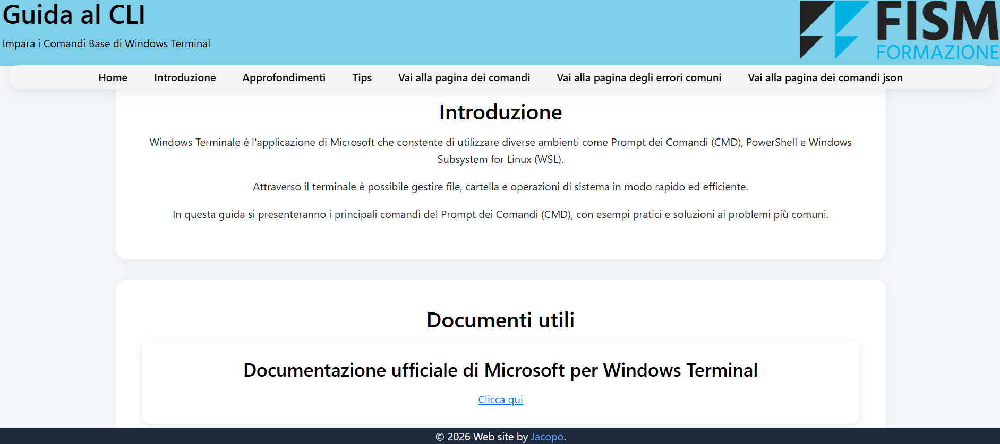
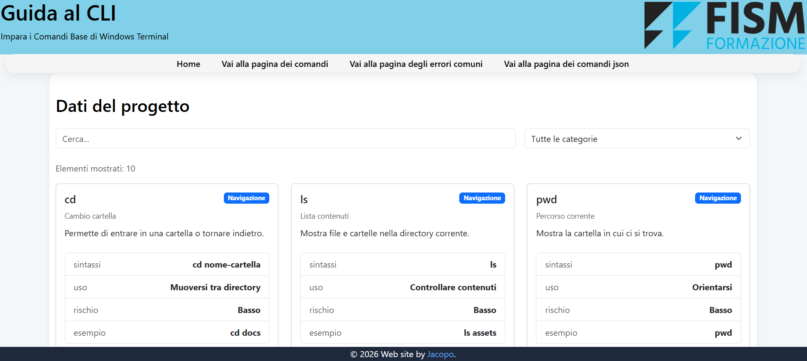
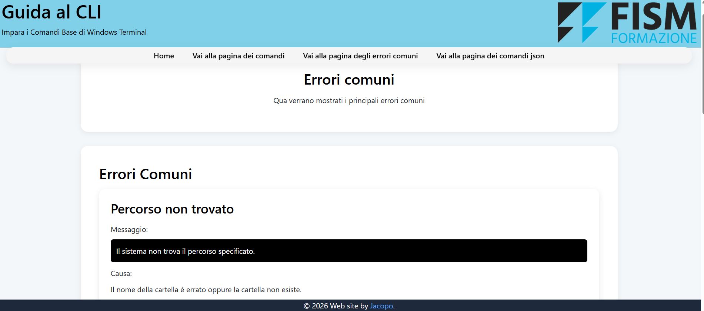

# Guida ai comandi del terminale

## Descrizione del progetto

 La presente guida è un sito web multipagina sui comandi base del terminale, con esempi e problemi comuni.  
 Sviluppata con HTML, CSS, Bootstrap e JavaScript e utilizza un file `data.json` per i contenuti dinamici.  

---

## Funzionalità

- Navigazione multipagina (Home, Comandi, Errori Comuni, Comandi con JSON)
- Generazione dinamica delle card tramite `data.json`
- Ricerca dei comandi con input text
- Filtro per categoria
- Layout moderno e responsive con Bootstrap e file CSS

---

## Caratteristiche tecniche

- HTML5
- CSS3
- Bootstrap 5
- JavaScript (Fetch API)
- JSON (data locale)

---

## Screenshots

### Index

### Comandi JSON

### Errori comuni

---

## Installazione e avvio

Leggi la [guida per l'installazione](/docs/INSTALLAZIONE.md) per i dettagli.

---

## Documenti

Nel

---

## Limitazioni note

- Non è stato implementato il backend

---

## Autori e Licenza

- Jacopo Nesti
- Progetto d'esame per il corso IFTS Software Developer.
- Questo progetto è rilasciato sotto licenza Unilicense. Vedi file [LICENSE](/LICENSE) per i dettagli.
- È stata scelta `The Unilicense` in quanto rinuncio a tutti i diritti possibili su questo codice. Potete usarla come volete.